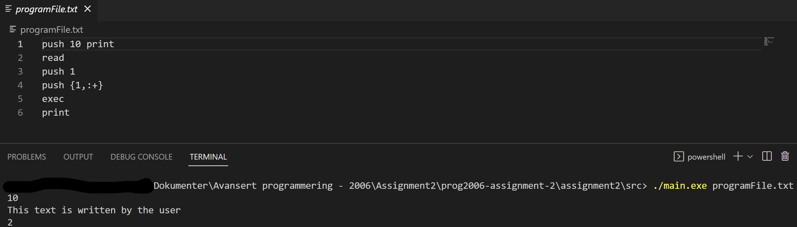
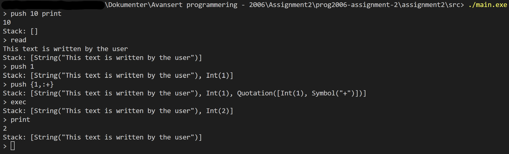

## How to use the program
The REAMDE file goes trough which functionalities the program has and what they do. So this document will desribed how you use the program and how you can parse in those commands. The program has two functionalities, one where you parse in an entire file, the program reads it, does what it says and after that quits. Example: 
{height="auto" width"auto"}

Example using the terminal (GHCI like) option:
{height="auto" width"auto"}